<h1 align="center">Hey, I'm Christopher LaFumee 👋</h1>
<h3 align="center">Full-Stack Software Engineer • Front-End Focused • Back-End Skillset </h3>

---

### 🚀 About Me

Full-Stack Software Engineer with a frontend focus, building practical, user-driven applications using React and Node.js.  
I enjoy turning ideas into clean interfaces backed by solid APIs and scalable logic.

Before transitioning into software engineering, I spent over a decade running my own health and wellness business, developing strong problem-solving, leadership, and client-focused product thinking.

Currently building real-world projects that combine strong UI/UX with thoughtful backend architecture.

---
## 🚀 Current Project
### 🧠 Skills Gym  
A full-stack coding challenge platform designed to deliver daily, progressive programming challenges through a custom API and interactive frontend.

**What it demonstrates:**
- REST API design and routing
- Data validation and error handling
- Frontend consumption of backend services
- Challenge filtering by difficulty
- Product thinking and scalability

**Tech:** Node.js, Express, React, Vite, JavaScript, TypeScript  
**Status:** Actively in development  

---

### 📌 Featured Projects

- 🏫 [**Skills Gym**](https://github.com/ChrisLaFumee/My-Portfolio): Coding challenge platform for interactive skill building and documenting progress
- 🎯 [**The Limitless Hub**](https://github.com/ChrisLaFumee/limitless-hub): Full-stack coaching & digital product platform for health and fitness pros  
- 🧰 [**Chris Cross Coding Portfolio**](https://github.com/ChrisLaFumee/My-Portfolio): My personal portfolio, resume, and project showcase

---

## 🛠️ Proficient Tech Stack

<table>
  <tr>
    <td valign="top">
      <strong>Core</strong>
      <ul>
        <li>JavaScript (ES6+)</li>
        <li>TypeScript</li>
        <li>Node.js, Express</li>
        <li>React, Vite</li>
        <li>REST APIs</li>
      </ul>
    </td>
    <td valign="top">
      <strong>Frontend</strong>
      <ul>
        <li>HTML, CSS</li>
        <li>Tailwind CSS</li>
        <li>Responsive design</li>
        <li>Component-based UI</li>
      </ul>
    </td>
    <td valign="top">
      <strong>Backend</strong>
      <ul>
        <li>API routing & controllers</li>
        <li>Middleware & error handling</li>
        <li>Data modeling & validation</li>
        <li>Logging & debugging</li>
      </ul>
    </td>
    <td valign="top">
      <strong>Tools</strong>
      <ul>
        <li>Git & GitHub</li>
        <li>Postman / curl</li>
        <li>VS Code</li>
      </ul>
    </td>
  </tr>
</table>

  
  
  
  
  
  
  
  

---

### 📈 GitHub Stats (Auto-updated)

  

  

---

### 🔗 Connect With Me

  
  
  
  

---

### 📌 Featured Projects

- 🎯 [**The Limitless Hub**](https://github.com/ChrisLaFumee/limitless-hub): Full-stack coaching & digital product platform for health and fitness pros  
- 🧰 [**Chris Cross Coding Portfolio**](https://github.com/ChrisLaFumee/My-Portfolio): My personal portfolio, resume, and project showcase

---

> 💬 “No Human is Limited - Kipchoge”

