<h1 align="center">Hey, I'm Christopher LaFumee 👋</h1>
<h3 align="center">Full-Stack Developer • Fitness Educator • Builder of Limitless Tools</h3>

---

### 🚀 About Me

I’m a software engineer with over a decade of experience in health, fitness, and coaching — now building digital products that elevate both human performance and tech accessibility.

I specialize in crafting sleek, responsive web apps using modern JavaScript stacks and design-first principles. My work blends clean code, engaging UI, and the kind of discipline forged through years of coaching others.

- 🧠 Currently mastering **backend engineering** (Node.js, Express, MongoDB)
- 🛠️ Building: [**The Limitless Hub**](https://github.com/ChrisLaFumee/limitless-hub) — my flagship fitness + coaching platform
- 💼 Actively seeking **remote front-end/full-stack roles**
- 🎯 Next goals: Master TypeScript + dive deeper into DevOps & deployment strategies

---

### 🛠 Tech Stack

  
  
  
  
  
  
  
  

---

### 📈 GitHub Stats (Auto-updated)

  

  

---

### 🔗 Connect With Me

  
  
  
  

---

### 📌 Featured Projects

- 🎯 [**The Limitless Hub**](https://github.com/ChrisLaFumee/limitless-hub): Full-stack coaching & digital product platform for health and fitness pros  
- 🧰 [**Chris Cross Coding Portfolio**](https://github.com/ChrisLaFumee/My-Portfolio): My personal portfolio, resume, and project showcase

---

> 💬 “No Human is Limited - Kipchoge”

